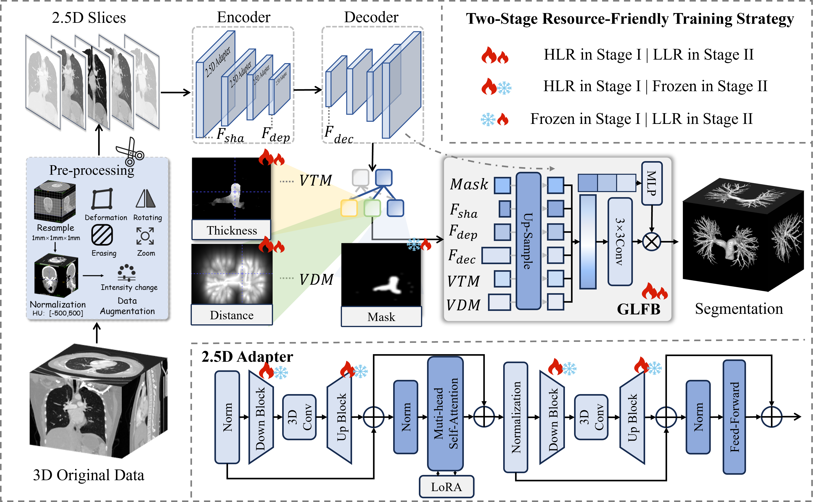
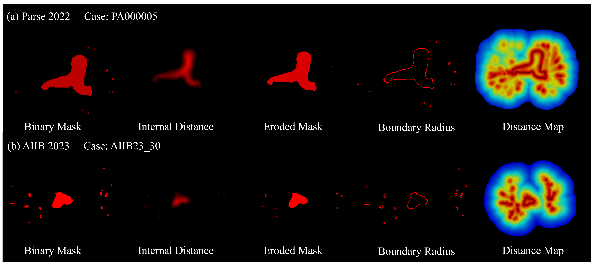
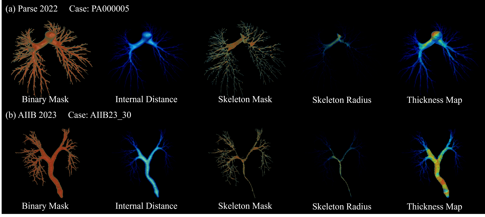

<p align="center">
  <h1 align="center">MorVess: Morphology-Aware Pulmonary Vessel Segmentation Network</h1>
</p>

<p align="center">
  <em>形态感知肺血管分割网络 — 首次将可微分几何先验融入基础模型以实现高保真血管拓扑重建</em>
</p>

<p align="center">
  
  
  
  
  
</p>

---

## 📌 概述

**MorVess** 是一种面向肺血管的形态感知分割框架，通过联合优化语义掩码与可微分几何先验（血管距离图 VDM + 血管厚度图 VTM），实现对血管边界、中心线连续性和管径平滑过渡的显式监督，从根本上解决细小血管遗漏和拓扑断裂问题。

### ✨ 核心特点

- 🔬 **几何先验联合监督**：首次将 VDM（边界势场）与 VTM（管径分布场）作为连续可微的监督信号，与分割任务端到端联合优化
- 🧊 **轻量级 2.5D Adapter**：在冻结的 SAM ViT 编码器中嵌入 3D 卷积适配器，以极低开销（1M 可训练参数）桥接 2D 预训练与 3D 体积上下文
- 🔗 **全局-局部融合模块（GLFB）**：聚合编码器多层特征与自预测的几何先验，通过动态 1×1 卷积实现样本自适应的高保真血管重建
- ⚡ **两阶段渐进训练**：Stage I 宏观空间适配 → Stage II 微观拓扑精调，显存仅需 4.2 GB

---

## 🏗️ 方法框架

### 整体架构

<p align="center">
  
</p>
<p align="center"><b>图 1.</b> MorVess 整体框架。轻量级 2.5D Adapter 增强冻结 SAM ViT 编码器的跨切片上下文，多头解码器联合预测语义掩码与几何先验，GLFB 融合多尺度语义与几何场以精细重建血管拓扑。两阶段微调（HLR → LLR）实现从宏观结构到微观拓扑的渐进优化。</p>


### 几何先验可视化

<p align="center">
  
</p>
<p align="center"><b>图 2.</b> 血管距离图（VDM）生成过程。将离散二值掩码通过形态学腐蚀和指数距离衰减转化为连续可微势场。</p>

<p align="center">
  
</p>
<p align="center"><b>图 3.</b> 血管厚度图（VTM）生成过程。从内部距离场提取拓扑骨架，将中心线半径传播至整个体积掩码。</p>


### 3D 分割结果可视化

<p align="center">
  
</p>
<p align="center"><b>图 4.</b> 分割结果的 3D 体积渲染对比。(a) Parse2022 数据集；(b) AIIB2023 数据集。白色箭头和虚线圈标注了具有挑战性的区域。MorVess 有效还原了连续的细分支并避免了假连接。</p>

---

## 📁 项目结构

```
MorVess/
├── 📄 README.md                          # 本文档
├── 📄 MorVess_Development_Guide.md       # 详细开发指南
│
├── 📄 train_hq_parse_stage1.py           # 🏋️ Stage I 训练脚本（512×512）
├── 📄 train_hq_parse_stage2.py           # 🏋️ Stage II 训练脚本（256×256）
├── 📄 test_parse_stage1.py               # 🔮 Stage I 推理/评估
├── 📄 test_parse_stage2.py               # 🔮 Stage II 推理/评估
│
├── 📄 generate_distance_map.py           # 📐 VDM 生成（单文件/批量）
├── 📄 generate_distance_process.py       # 📐 VDM 批量预处理管线
├── 📄 generate_batch_distance_map.py     # 📐 VDM 批量生成工具
├── 📄 generate_thickness.py              # 📐 VTM 生成（中轴+最大内接球）
├── 📄 generate_thickness_process.py      # 📐 VTM 批量预处理管线
│
├── 📂 datasets/                          # 数据集加载与增强
│   ├── 📄 dataset.py                     # 基础数据加载器
│   ├── 📄 dataset_distance.py            # ★ 多任务数据加载器（含 VDM/VTM）
│   ├── 📄 dispersion_analysis.py         # 特征空间分布分析
│   └── 📄 ...
│
├── 📂 preprocessing/                     # 数据预处理脚本
│   ├── 📄 util_script_parse2022_ok.py    # ★ Parse2022 预处理 & CSV 生成
│   ├── 📄 util_sript_aiib23.py           # AIIB2023 预处理
│   └── 📄 ...
│
└── 📂 segment_anything/                  # ★ 核心模型库（基于 SAM 修改）
    ├── 📄 build_sam.py                   # 模型工厂 & 注册表
    └── 📂 modeling/
        ├── 📄 image_encoder_hq.py        # ★ HQ 编码器 + 2.5D Adapter
        ├── 📄 mask_decoder_hq.py         # ★ 多头几何预测解码器
        ├── 📄 hq_refiner.py              # ★ GLFB 全局-局部融合模块
        ├── 📄 sam_distance_hq.py         # ★ MorVess 完整模型
        ├── 📄 transformer.py             # 双向 Transformer
        ├── 📄 prompt_encoder.py          # 提示编码器
        └── 📄 ...
```

---

## 🔧 环境安装

### 前置要求

- Python 3.8+
- CUDA 11.8+
- PyTorch 2.0+

### 安装步骤

```bash
# 1. 克隆仓库
git clone https://github.com/Wu-beining/MorVess.git
cd MorVess

# 2. 安装依赖
pip install torch torchvision --index-url https://download.pytorch.org/whl/cu118
pip install SimpleITK nibabel scipy numpy pandas einops icecream opencv-python Pillow tqdm h5py

# 3. 验证安装
python -c "import torch; print(f'PyTorch {torch.__version__}, CUDA: {torch.cuda.is_available()}')"
```

### 关键依赖

| 库 | 版本 | 用途 |
|---|------|------|
| PyTorch | ≥ 2.0 | 深度学习框架 |
| SimpleITK | — | NIfTI 医学影像 I/O |
| nibabel | — | 3D 体积数据加载 |
| scipy | — | 欧几里得距离变换 / 骨架提取 |
| einops | — | 张量重排 |
| pandas | — | 训练集 CSV 管理 |

### 预训练权重

下载 SAM ViT-Base 预训练权重 ([sam_vit_b_01ec64.pth](https://dl.fbaipublicfiles.com/segment_anything/sam_vit_b_01ec64.pth)) 并放置于 `pretrained_weights/` 目录。

---

## 📦 数据集

### 支持的数据集

| 数据集 | 来源 | 规模 | 特点 |
|--------|------|------|------|
| [Parse2022](https://parse2022.grand-challenge.org/) | MICCAI 2022 | 100 例 3D CT | 正常解剖，多层级分支 |
| [AIIB2023](https://zenodo.org/records/10041596) | AIIB Challenge | 肺纤维化 CT | 病理变形，跨域泛化评估 |

### 数据预处理流程

```
原始 3D CT (.nii.gz)
    │
    ├── ① HU 裁剪 [-500, 500] & 归一化
    ├── ② 生成 VDM（边界势场） ← generate_distance_map.py
    ├── ③ 生成 VTM（厚度图）   ← generate_thickness.py
    ├── ④ 2.5D 切片（5-slice 堆叠 + 镜像填充）
    └── ⑤ 生成 training.csv    ← preprocessing/util_script_parse2022_ok.py
```

### 预处理后的目录结构

```
data/parse2022/train/2D_all_5slice/
├── training.csv                       # 五列路径索引
├── PA000001/
│   ├── images/          # 2Dimage_XXXX.pkl  (5-slice CT)
│   ├── masks/           # 2Dmask_XXXX.pkl   (分割标签)
│   ├── boundary_potential/  # 2Dboundary_XXXX.pkl  (VDM)
│   ├── internal_distance/   # 2Dinternal_XXXX.pkl  (内部距离)
│   └── thickness_map/       # 2Dthickness_XXXX.pkl (VTM)
├── PA000002/
│   └── ...
```

---

## 🚀 快速开始

### 数据预处理

```bash
# Step 1: 生成血管距离图 (VDM)
python generate_distance_map.py \
  -i /path/to/parse2022/train -o /path/to/output --batch -l 0.05

# Step 2: 生成血管厚度图 (VTM)
python generate_thickness.py \
  -i /path/to/parse2022/train -o /path/to/thickness_output \
  --batch --out_subdir thickness_map

# Step 3: 生成 2.5D 切片 & CSV 索引
python preprocessing/util_script_parse2022_ok.py
```

### 训练

```bash
# Stage I: 宏观特征与 2.5D 适配 (512×512)
python train_hq_parse_stage1.py \
  --root_path /path/to/2D_all_5slice \
  --output ./res_hq-par-512-stage1 \
  --ckpt ./pretrained_weights/sam_vit_b_01ec64.pth \
  --img_size 512 --batch_size 1 --max_epochs 400

# Stage II: 拓扑精调 (256×256)
python train_hq_parse_stage2.py \
  --root_path /path/to/2D_all_5slice \
  --output ./res_hq-par-256-stage2 \
  --ckpt ./pretrained_weights/sam_vit_b_01ec64.pth \
  --img_size 256 --batch_size 8 --max_epochs 400
```

<details>
<summary>📋 完整训练参数说明</summary>

| 参数 | 默认值 | 说明 |
|------|--------|------|
| `--root_path` | — | 预处理后的 2.5D 数据根目录 |
| `--output` | — | 模型输出目录 |
| `--num_classes` | 1 | 前景类别数（二类分割=1） |
| `--batch_size` | 1 / 8 | Stage I: 1, Stage II: 8 |
| `--img_size` | 512 / 256 | Stage I: 512, Stage II: 256 |
| `--base_lr` | 1e-5 | 初始学习率 |
| `--max_epochs` | 400 | 最大训练轮次 |
| `--vit_name` | `vit_b` | ViT 变体 |
| `--ckpt` | — | SAM 预训练权重路径 |
| `--rank` | 32 | FacT 低秩分解秩 |
| `--dice_param` | 0.8 | Dice 损失权重 |
| `--warmup_period` | 100 / 500 | 预热迭代数 |
| `--use_amp` | True | 混合精度训练 |
| `--tf32` | True | 启用 TF32 加速 |

</details>

### 推理 / 测试

```bash
python test_parse_stage1.py \
  --task parse \
  --root_path /path/to/2D_all_5slice \
  --output_dir ./test_output \
  --num_classes 1 --img_size 512 --is_savenii
```

**输出**: 预测的 NIfTI 分割结果保存到 `--output_dir`，同时输出 Dice / clDice / HD95 等评估指标。

---

## 🧩 网络架构核心模块

### 模块总览

```
┌──────────────────────── 编码器 ─────────────────────────┐
│  ImageEncoderViT_hq                                     │
│  ├── Frozen SAM ViT-Base (12 Transformer Blocks)        │
│  ├── 2.5D Adapter (每个 Block 内嵌 3D Conv)              │
│  └── 多层特征输出 (F_early + F_last)                     │
└─────────────────────────────────────────────────────────┘
                         ↓
┌──────────────────────── 解码器 ─────────────────────────┐
│  MaskDecoder_multi_hq                                   │
│  ├── 主分支: mask tokens → 超网络 MLP → 分割掩码         │
│  ├── VDM 分支: avg(mask_tokens) → MLP → 距离图           │
│  ├── VTM 分支: avg(mask_tokens) → MLP → 厚度图           │
│  └── GLFB: hq_token + F_dec + F_early + F_last          │
│           + VDM + VTM + |∇VDM|                          │
│           → 融合卷积 → 动态 1×1 conv → 门控残差           │
└─────────────────────────────────────────────────────────┘
```

### 损失函数

$$\mathcal{L}_{total} = \lambda_1 \mathcal{L}_{CE} + \lambda_2 \mathcal{L}_{Dice} + \lambda_3 \mathcal{L}_{clDice} + \lambda_4 \mathcal{L}_{dist} + \lambda_5 \mathcal{L}_{thick}$$

| 损失项 | 作用 | 说明 |
|--------|------|------|
| $\mathcal{L}_{CE}$ | 逐体素分类 | 交叉熵损失 |
| $\mathcal{L}_{Dice}$ | 区域重叠 | 缓解类别不平衡 |
| $\mathcal{L}_{clDice}$ | 拓扑连通性 | 中心线骨架重叠约束 |
| $\mathcal{L}_{dist}$ | 边界距离场 | Sigmoid + L1 |
| $\mathcal{L}_{thick}$ | 厚度场 | Softplus + 归一化 L1（尺度不变） |

### 两阶段训练策略

| | Stage I: 宏观适配 | Stage II: 拓扑精调 |
|---|---|---|
| **训练组件** | 2.5D Adapter + FacT + 解码器 + GLFB | GLFB + VDM/VTM 预测头 |
| **冻结组件** | SAM ViT 主体 | 2.5D Adapter（已收敛）|
| **分辨率** | 512×512 | 256×256 |
| **学习率** | 1×10⁻⁵ | 5×10⁻⁵ |
| **调度器** | 多项式衰减 (power=7) | 余弦退火 |
| **批大小** | 1 | 8 |

---

## 📊 实验结果

### 对比实验

<table>
  <thead>
    <tr>
      <th rowspan="2">Method</th>
      <th colspan="3">Parse2022 Dataset</th>
      <th colspan="3">AIIB2023 Dataset</th>
    </tr>
    <tr>
      <th>Dice ↑</th>
      <th>clDice ↑</th>
      <th>HD95 ↓</th>
      <th>Dice ↑</th>
      <th>clDice ↑</th>
      <th>HD95 ↓</th>
    </tr>
  </thead>
  <tbody>
    <tr>
      <td>VISTA3D</td>
      <td>78.24±4.72</td>
      <td>63.21±5.97</td>
      <td>14.23±4.18</td>
      <td>83.81±9.81</td>
      <td>76.24±5.22</td>
      <td>9.23±6.23</td>
    </tr>
    <tr>
      <td>nn-UNET-V2</td>
      <td>77.28±5.83</td>
      <td>75.31±5.83</td>
      <td>9.53±3.86</td>
      <td>92.83±6.55</td>
      <td>84.31±5.09</td>
      <td>5.92±6.01</td>
    </tr>
    <tr>
      <td>Swin-UNETR</td>
      <td>76.85±5.28</td>
      <td>70.19±5.53</td>
      <td>11.26±4.12</td>
      <td>90.53±9.81</td>
      <td>80.13±4.88</td>
      <td>8.42±5.82</td>
    </tr>
    <tr>
      <td>SegMamba</td>
      <td>79.24±5.19</td>
      <td>73.18±4.69</td>
      <td>9.91±3.79</td>
      <td>91.29±7.24</td>
      <td>85.51±5.29</td>
      <td>4.59±6.11</td>
    </tr>
    <tr>
      <td>Diff-UNet</td>
      <td>76.24±4.55</td>
      <td>71.26±4.27</td>
      <td>9.65±3.62</td>
      <td>90.48±7.19</td>
      <td>86.32±4.42</td>
      <td>4.67±5.57</td>
    </tr>
    <tr>
      <td>DSCNet</td>
      <td>80.32±4.97</td>
      <td>81.03±3.08</td>
      <td>5.35±2.75</td>
      <td>92.15±5.84</td>
      <td>85.22±4.74</td>
      <td>5.39±5.23</td>
    </tr>
    <tr>
      <td>COMMA</td>
      <td>83.27±4.29</td>
      <td>80.10±3.74</td>
      <td>5.11±3.42</td>
      <td>92.88±5.25</td>
      <td>86.23±3.94</td>
      <td>4.25±4.94</td>
    </tr>
    <tr>
      <td><strong>MorVess (Ours)</strong></td>
      <td><strong>86.84±4.18</strong></td>
      <td><strong>83.22±3.17</strong></td>
      <td><strong>4.53±3.06</strong></td>
      <td><strong>94.31±3.52</strong></td>
      <td><strong>89.34±3.46</strong></td>
      <td><strong>3.24±4.81</strong></td>
    </tr>
  </tbody>
</table>

> **关键发现**: 相比第二名方法 COMMA，MorVess 在 Parse2022 上 Dice 提升 **+3.57%**，clDice 提升 **+3.12%**，HD95 降低 **−0.58 mm**，验证了几何先验监督对血管拓扑完整性的关键作用。

### 消融实验：几何先验有效性

<table>
  <thead>
    <tr>
      <th>配置</th>
      <th>Dice ↑</th>
      <th>clDice ↑</th>
      <th>HD95(mm) ↓</th>
      <th>AMR ↓</th>
      <th>DBR ↑</th>
      <th>DLR ↑</th>
    </tr>
  </thead>
  <tbody>
    <tr>
      <td>Baseline</td>
      <td>82.40±5.89</td>
      <td>74.24±4.15</td>
      <td>6.85±5.22</td>
      <td>0.22±0.15</td>
      <td>0.62±0.14</td>
      <td>0.72±0.16</td>
    </tr>
    <tr>
      <td>+ VDM</td>
      <td>83.90±4.53</td>
      <td>79.32±3.86</td>
      <td>5.72±4.86</td>
      <td>0.18±0.13</td>
      <td>0.68±0.11</td>
      <td>0.78±0.13</td>
    </tr>
    <tr>
      <td>+ VTM</td>
      <td>84.10±4.65</td>
      <td>78.75±4.02</td>
      <td>5.59±4.52</td>
      <td>0.19±0.10</td>
      <td>0.67±0.12</td>
      <td>0.77±0.09</td>
    </tr>
    <tr>
      <td><strong>+ VDM + VTM</strong></td>
      <td><strong>86.84±4.18</strong></td>
      <td><strong>83.22±3.17</strong></td>
      <td><strong>4.53±3.06</strong></td>
      <td><strong>0.12±0.09</strong></td>
      <td><strong>0.80±0.08</strong></td>
      <td><strong>0.83±0.08</strong></td>
    </tr>
  </tbody>
</table>

### 消融实验：模块贡献

<table>
  <thead>
    <tr>
      <th>Pretrained Weights</th>
      <th>2.5D Adapter</th>
      <th>GLFB</th>
      <th>Dice Score ↑</th>
    </tr>
  </thead>
  <tbody>
    <tr><td>✗</td><td>✗</td><td>✗</td><td>0.6844</td></tr>
    <tr><td>✗</td><td>✔</td><td>✗</td><td>0.7233 <sub>(+0.039)</sub></td></tr>
    <tr><td>✗</td><td>✗</td><td>✔</td><td>0.7481 <sub>(+0.064)</sub></td></tr>
    <tr><td>✗</td><td>✔</td><td>✔</td><td>0.7626 <sub>(+0.078)</sub></td></tr>
    <tr><td>✔</td><td>✔</td><td>✗</td><td>0.8392 <sub>(+0.155)</sub></td></tr>
    <tr><td><strong>✔</strong></td><td><strong>✔</strong></td><td><strong>✔</strong></td><td><strong>0.8544 <sub>(+0.170)</sub></strong></td></tr>
  </tbody>
</table>

### 计算效率对比

| Method | Trainable Params | Total Params | GMACs/stack | VRAM (GB) |
|--------|:---:|:---:|:---:|:---:|
| nnU-Net | 32 M | 32 M | 180 | 18 |
| Diff-UNet | 64 M | 64 M | 340 | 32 |
| **MorVess** | **1.0 M** | **93.6 M** | **42** | **4.2** |

---

## 📐 技术细节

### 几何先验生成

**VDM（血管距离图）**：边界势场，在血管壁处 VDM=1，向内外指数衰减

$$\text{VDM}(x) = \exp\left(-\lambda \cdot \min_{y \in \partial\Omega} \| (x - y) \odot S_p \|_2 \right)$$

**VTM（血管厚度图）**：管径分布场，基于中轴骨架的最大内接球半径传播

$$\text{VTM}(x) = 2 \cdot D_{internal}\left(\arg\min_{s \in S} \| (x - s) \odot S_p \|_2 \right)$$

### 评估指标体系

| 指标 | 缩写 | 方向 | 说明 |
|------|------|:---:|------|
| Dice 系数 | DSC | ↑ | 体素级空间重叠 |
| 中心线 Dice | clDice | ↑ | 血管骨架重叠，评估拓扑连通性 |
| 95% 豪斯多夫距离 | HD95 | ↓ | 边界几何一致性 (mm) |
| 表观缺失率 | AMR | ↓ | 假阴性比例 |
| 检出分支比 | DBR | ↑ | 分支节点检出完整性 |
| 检出长度比 | DLR | ↑ | 血管整体长度恢复度 |

---

## 📂 Checkpoint 格式

训练保存的 `.pth` 文件通过 FacT 模块的 `save_parameters` / `load_parameters` 接口管理：

```python
# 加载模型
sam, img_embedding_size = sam_model_registry["vit_b_distance_thickness_hq"](
    image_size=512, num_classes=1,
    checkpoint="pretrained_weights/sam_vit_b_01ec64.pth",
    pixel_mean=[0., 0., 0.], pixel_std=[1., 1., 1.]
)
net = Fact_tt_Sam_hq(sam, rank=32, s=1.0).cuda()
net.load_parameters("path/to/epoch_XX.pth")
```

---

## 🙏 致谢

本工作得到以下机构支持：中南大学高性能计算中心、浙江省高校基本科研业务费专项（No. GK259909299001-006）、浙大 CAD&CG 国家重点实验室（A2510）、安徽省智能教育装备与技术联合重点实验室（No. IEET202401）、中南大学研究生科研创新项目（No. 1053320241117）。

---


## 📄 License

This project is licensed under the MIT License. See the [LICENSE](LICENSE) file for details.
